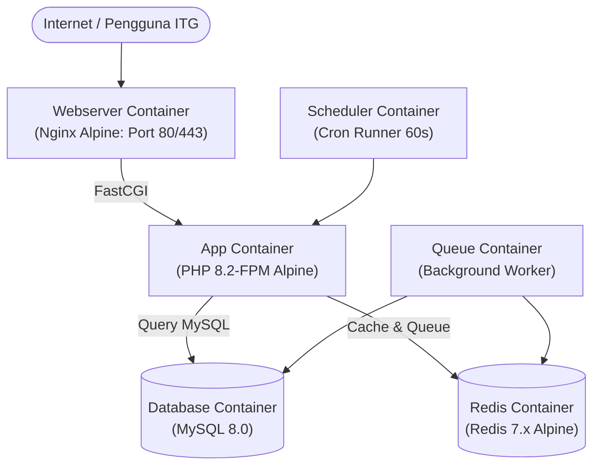

# PANDUAN DEPLOYMENT & PERSIAPAN PRODUCTION
# SISTEM INFORMASI & KEUANGAN ORMAWA (SKIN ITG)
**Institut Teknologi Garut — Versi Rilis 1.0 (Production Ready)**

---

## 1. Ringkasan Eksekutif & Pilihan Metode Deployment

Dokumen ini disusun sebagai panduan teknis resmi bagi **Tim DevOps / IT Infrastructure ITG** dalam mempersiapkan, memasang (*deploy*), mengonfigurasi, dan memelihara aplikasi **SKIN ITG** di lingkungan server produksi (*Production Environment*).

Sistem mendukung 2 (dua) metode deployment resmi:
1. **Metode A (Rekomendasi Utama): Containerized Docker Multi-Container** (Cepat, terisolasi, terstandarisasi, dan mudah di-scale).
2. **Metode B: Bare-Metal / Virtual Machine Tradisional** (Nginx + PHP-FPM + MySQL di OS Host).

---

## 2. Arsitektur Docker Multi-Container (Metode A - Rekomendasi)

Aplikasi telah dikemas secara penuh menggunakan Docker dengan arsitektur multi-container yang siap pakai:



### Komponen Kontainer dalam `docker-compose.yml`:
| Service | Image / Base | Peran & Fungsi |
| :--- | :--- | :--- |
| **`app`** | `Dockerfile` (PHP 8.2 Alpine Multi-stage) | Menjalankan backend Laravel via PHP-FPM 9000 dengan ekstensi `gd`, `pdo_mysql`, `redis`, `opcache`. |
| **`webserver`** | `nginx:alpine` | Reverse proxy, kompresi HTTP/2, security headers, dan serving aset publik statis (`public/build`). |
| **`db`** | `mysql:8.0` | Basis data utama dengan penyimpanan persisten pada volume Docker `skin_dbdata`. |
| **`redis`** | `redis:7-alpine` | Broker antrean background worker, cache aplikasi, dan manajemen session. |
| **`queue`** | `Dockerfile` (Worker) | Menjalankan `php artisan queue:work redis` secara terus-menerus untuk email & notifikasi. |
| **`scheduler`** | `Dockerfile` (Cron) | Menjalankan `php artisan schedule:run` setiap 60 detik untuk pemeriksaan pengingat proposal & LPJ. |

---

## 3. Langkah Deployment Cepat via Docker (Quickstart)

### Langkah 1: Persiapan Environment
```bash
cd /var/www/skin-itg

# Salin template environment khusus Docker
cp .env.docker.example .env

# Sesuaikan konfigurasi pada berkas .env:
# 1. APP_URL=https://ormawa.itg.ac.id
# 2. DB_PASSWORD dan DB_ROOT_PASSWORD (gunakan kata sandi kuat)
# 3. SEED_USER_DOMAIN=itg.ac.id
# 4. Konfigurasi kredensial SMTP Email ITG
nano .env
```

### Langkah 2: Build & Jalankan Seluruh Kontainer
```bash
# Bangun image multi-stage (otomatis build aset frontend Vite dan dependensi PHP)
docker compose up -d --build
```

### Langkah 3: Inisialisasi Database & Seeder Produksi
```bash
# Buat kunci enkripsi aplikasi
docker compose exec app php artisan key:generate --force

# Buat symlink direktori storage publik
docker compose exec app php artisan storage:link

# Jalankan migrasi tabel database
docker compose exec app php artisan migrate --force

# Jalankan seeder master data resmi (UserSeeder otomatis siap produksi)
docker compose exec app php artisan db:seed --class=RolePermissionSeeder --force
docker compose exec app php artisan db:seed --class=WorkflowSeeder --force
docker compose exec app php artisan db:seed --class=KonfigurasiSeeder --force
docker compose exec app php artisan db:seed --class=MasterDataSeeder --force
docker compose exec app php artisan db:seed --class=PeriodeAnggaranSeeder --force
docker compose exec app php artisan db:seed --class=UserSeeder --force
```

> **CATATAN DEVOPS:**  
> `UserSeeder` akan mencetak kredensial awal akun master di terminal. Pastikan untuk mencatat password awal tersebut!

---

## 4. Mekanisme UserSeeder (Ready Production)

File [`database/seeders/UserSeeder.php`](file:///c:/laragon/www/sistem_keuangan/database/seeders/UserSeeder.php) telah dirancang khusus agar aman dan terisolasi untuk lingkungan produksi:

1. **Prinsip Akun Bootstrap Awal (Hanya Admin & BKHM):**
   - Di lingkungan produksi (`APP_ENV=production`), seeder **HANYA membuat 2 (dua) akun bootstrap awal**:
     - **`admin`** (`admin@itg.ac.id`): Administrator sistem untuk konfigurasi aplikasi, manajemen infrastruktur, dan penanganan bug teknis.
     - **`bkhm`** (`bkhm@itg.ac.id`): Biro Kemahasiswaan & Hubungan Masyarakat selaku otoritas resmi pengelola ormawa dan kemahasiswaan kampus.
   - **Akun Lainnya Tidak Dibuat oleh Seeder**: Seluruh akun pejabat kampus (BEM, BPM, WR3, Bendahara, Sarpras) dan ormawa resmi (HIMA & UKM) **akan didaftarkan langsung oleh staf BKHM** melalui menu antarmuka web resmi: **Kelola Pengguna** (`/admin/users`) lengkap dengan penetapan pagu saldo ormawa riil per periode anggaran.

2. **Otomatisasi Domain Kampus:**
   - Akun produksi otomatis menggunakan domain **`@itg.ac.id`** (`admin@itg.ac.id`, `bkhm@itg.ac.id`).
   - Domain dapat dikustomisasi via variabel `.env`: `SEED_USER_DOMAIN=itg.ac.id`.

3. **Pengamanan Password Akun Bootstrap:**
   - Jika `SEED_DEFAULT_PASSWORD` diisi di `.env`, password tersebut akan digunakan sebagai password awal akun baru.
   - Jika tidak diisi di lingkungan produksi, sistem secara otomatis menghasilkan **password acak 16 karakter yang kuat (*cryptographically secure*)** dan menampilkannya di konsol terminal saat seeding berlangsung.
   - Tim DevOps juga dapat menentukan email dan password khusus via `.env` (`ADMIN_EMAIL`, `ADMIN_PASSWORD`, `BKHM_EMAIL`, `BKHM_PASSWORD`).

4. **Proteksi Anti-Overwrite:**
   - Jika seeder dijalankan ulang di kemudian hari (*re-seed*), sistem **TIDAK AKAN menimpa password akun yang sudah ada**, sehingga mencegah akun ter-reset secara tidak sengaja.

---

## 5. Deployment Bare-Metal / VM Tradisional (Metode B)

Jika institusi memilih untuk tidak menggunakan Docker, ikuti panduan bare-metal berikut:

### Kebutuhan Server Minimum
- **OS:** Ubuntu Server 22.04 LTS atau 24.04 LTS
- **CPU:** 2–4 vCPU, **RAM:** 4–8 GB, **SSD:** 40 GB+
- **Paket Wajib:**
```bash
sudo apt update && sudo apt install -y php8.2-fpm php8.2-cli php8.2-mysql php8.2-curl \
    php8.2-gd php8.2-mbstring php8.2-xml php8.2-zip php8.2-bcmath \
    php8.2-intl php8.2-redis nginx mysql-server supervisor redis-server git unzip
```

### Langkah Instalasi Bare-Metal:
```bash
cd /var/www/skin-itg

# 1. Dependensi
composer install --no-dev --optimize-autoloader --no-interaction
npm ci && npm run build

# 2. Inisialisasi
php artisan key:generate --force
php artisan storage:link
php artisan migrate --force

# 3. Master Seeding
php artisan db:seed --class=RolePermissionSeeder --force
php artisan db:seed --class=WorkflowSeeder --force
php artisan db:seed --class=KonfigurasiSeeder --force
php artisan db:seed --class=MasterDataSeeder --force
php artisan db:seed --class=PeriodeAnggaranSeeder --force
php artisan db:seed --class=UserSeeder --force

# 4. Hak Akses File
sudo chown -R www-data:www-data storage bootstrap/cache
sudo chmod -R 775 storage bootstrap/cache

# 5. Cache Optimasi
php artisan config:cache
php artisan route:cache
php artisan view:cache
php artisan event:cache
```

---

## 6. Konfigurasi Nginx untuk Bare-Metal

File `/etc/nginx/sites-available/skin-itg`:

```nginx
server {
    listen 80;
    listen [::]:80;
    server_name ormawa.itg.ac.id;
    return 301 https://$host$request_uri;
}

server {
    listen 443 ssl http2;
    listen [::]:443 ssl http2;
    server_name ormawa.itg.ac.id;

    root /var/www/skin-itg/public;
    index index.php index.html;

    ssl_certificate /etc/letsencrypt/live/ormawa.itg.ac.id/fullchain.pem;
    ssl_certificate_key /etc/letsencrypt/live/ormawa.itg.ac.id/privkey.pem;

    client_max_body_size 35M;

    add_header X-Frame-Options "SAMEORIGIN" always;
    add_header X-Content-Type-Options "nosniff" always;
    add_header X-XSS-Protection "1; mode=block" always;
    add_header Referrer-Policy "strict-origin-when-cross-origin" always;

    charset utf-8;

    location / {
        try_files $uri $uri/ /index.php?$query_string;
    }

    location = /favicon.ico { access_log off; log_not_found off; }
    location = /robots.txt  { access_log off; log_not_found off; }

    location ~ /\.(?!well-known).* {
        deny all;
    }

    location ~ \.php$ {
        fastcgi_pass unix:/var/run/php/php8.2-fpm.sock;
        fastcgi_param SCRIPT_FILENAME $realpath_root$fastcgi_script_name;
        include fastcgi_params;
        fastcgi_hide_header X-Powered-By;
        fastcgi_read_timeout 180;
    }
}
```

---

## 7. Background Worker & Penjadwalan (Bare-Metal)

### Crontab Penjadwalan:
```cron
* * * * * cd /var/www/skin-itg && php artisan schedule:run >> /dev/null 2>&1
```

### Supervisor Worker (`/etc/supervisor/conf.d/skin-worker.conf`):
```ini
[program:skin-worker]
process_name=%(program_name)s_%(process_num)02d
command=php /var/www/skin-itg/artisan queue:work redis --sleep=3 --tries=3 --timeout=120
autostart=true
autorestart=true
user=www-data
numprocs=2
redirect_stderr=true
stdout_logfile=/var/www/skin-itg/storage/logs/worker.log
```

---

## 8. Backup & Pemulihan Data (Disaster Recovery)

Skrip backup harian otomatis (`/usr/local/bin/backup-skin.sh`):

```bash
#!/bin/bash
BACKUP_DIR="/var/backups/skin-itg"
DATE=$(date +"%Y%m%d_%H%M%S")
mkdir -p $BACKUP_DIR

# Backup MySQL (Docker atau Host)
if command -v docker &> /dev/null && docker ps | grep -q skin_db; then
    docker exec skin_db mysqldump -u skin_user -p'PASSWORD_DB' skin_itg | gzip > "$BACKUP_DIR/db_skin_$DATE.sql.gz"
else
    mysqldump -u skin_user -p'PASSWORD_DB' skin_itg | gzip > "$BACKUP_DIR/db_skin_$DATE.sql.gz"
fi

# Backup Dokumen Proposal & LPJ (storage/app)
tar -czf "$BACKUP_DIR/storage_skin_$DATE.tar.gz" -C /var/www/skin-itg/storage/app .

# Hapus backup yang lebih lama dari 30 hari
find $BACKUP_DIR -type f -mtime +30 -delete
```

---

## 9. Checklist Go-Live (Smoke Testing)

Sebelum sistem diumumkan secara resmi ke publik kampus ITG, lakukan pengujian verifikasi berikut:

| No | Modul / Fungsionalitas | Kriteria Keberhasilan | Status |
|:---|:---|:---|:---:|
| 1 | **Akses Domain & HTTPS** | Akses via `https://ormawa.itg.ac.id`, sertifikat SSL valid, redirect otomatis dari port 80 ke 443. | [ ] |
| 2 | **Keamanan Rute Dev** | Mengakses `/dev-login/admin@itg.ac.id` memunculkan respon **404 Not Found**. | [ ] |
| 3 | **Mode Debug Nonaktif** | URL yang salah menghasilkan halaman custom 404 ITG (bukan stack trace Laravel Flare). | [ ] |
| 4 | **Login Akun Master** | Akun Admin, BEM, BPM, BKHM, WR3, Bendahara, dan Ormawa dapat login menggunakan kredensial produksi. | [ ] |
| 5 | **Pengajuan & Upload Dokumen** | Ormawa berhasil mengajukan proposal, berkas PDF tersimpan aman di disk privat (`storage/app/proposals`). | [ ] |
| 6 | **Pratinjau PDF Tanpa 404** | Halaman verifikasi proposal menampilkan pratinjau PDF atau card status yang rapi tanpa iframe error 404. | [ ] |
| 7 | **Tanda Tangan Digital QR Code** | Dokumen hasil generate memiliki QR Code, dan scan QR Code mengarah ke URL publik verifikasi yang sah. | [ ] |
| 8 | **Kalender & Peminjaman Sarpras** | Peminjaman tempat/barang dapat diajukan dan terdeteksi di kalender tanpa tabrakan jadwal. | [ ] |
| 9 | **Queue Worker & Notifikasi** | Perubahan status alur verifikasi memicu notifikasi sistem dan email terkirim. | [ ] |
| 10 | **Backup Otomatis** | Eksekusi script backup menghasilkan arsip `.sql.gz` dan `.tar.gz` yang utuh. | [ ] |

---
**Institut Teknologi Garut — Sistem Informasi & Keuangan Ormawa (SKIN ITG)**  
Dokumen Terbit: Oktober 2026 | Versi 1.1 (Docker Ready)
