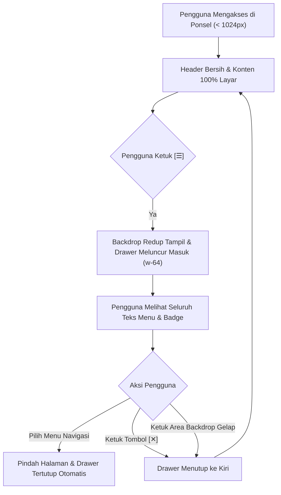

# 📱 Dokumentasi Optimasi Antarmuka Mobile & Sidebar Drawer (UI-022)

**Proyek:** SKIN ITG (Sistem Informasi Kemahasiswaan Terpadu)  
**Modul:** Shell Navigasi Utama (`layouts.app`, `layouts.sidebar`, `layouts.user-menu`)  
**Tanggal Update:** 1 Oktober 2026  
**Status:** 🟢 **SELESAI & LIVE TERIMPLEMENTASI (Commit: `0ba30f5`)**  

---

## 1. Latar Belakang & Analisis Permasalahan Mobile

Pada pengujian antarmuka di perangkat layar sempit (*smartphone* / mobile viewport lebar 360px – 390px), ditemukan dua kendala utama yang menurunkan kenyamanan pengguna (*user experience*):

```
┌────────────────────────────────────────────────────────┐
│ [☰] [● T.A. 2026/2027...] [🔔] [⚠️] [B ⌵]              │ ◄── ELEMEN HEADER BERTUMPUKAN
├───────┬────────────────────────────────────────────────┤
│       │                                                │
│ 80px  │                 AREA KONTEN                    │ ◄── KONTEN TERHIMPIT SANGAT SEMPIT
│ MINI  │          (Hanya tersisa ~280px-300px)          │     (Tabel, notifikasi, kartu dana rusak)
│ SIDE- │                                                │
│  BAR  │                                                │
│       │                                                │
└───────┴────────────────────────────────────────────────┘
```

1. **Header Atas Bertumpukan (*Top Bar Collision*):**
   - Di navbar atas sebelah kanan tombol hamburger `[☰]`, badge Tahun Akademik `● T.A. 2026/2027 Ganjil` memiliki sifat `shrink-0`.
   - Di sisi kanan terdapat ikon Lonceng Notifikasi (`🔔`), Lapor Bug (`⚠️`), dan Menu Profil (`B ⌵`).
   - Karena keterbatasan lebar horizontal di ponsel (360px–390px), badge Tahun Akademik terdorong ke kanan dan menimpa langsung ikon notifikasi. Judul halaman pun terhimpit hingga tidak terbaca.
2. **Sidebar Mengambil Ruang Terlalu Lebar Secara Statis:**
   - Sidebar desktop sebelumnya tetap ditampilkan sebagai kolom flex permanen selebar 80px (`w-20`) di ponsel.
   - Hal ini memangkas ruang konten halaman hingga 25%, membuat halaman dashboard, daftar notifikasi, serta formulir pengajuan terasa sesak dan sulit dioperasikan dengan jari.

---

## 2. Solusi Desain: Off-Canvas Mobile Drawer & Anti-Collision Top Bar

```
┌────────────────────────────────────────────────────────┐
│ [☰]  Pusat Notifikasi                [🔔]  [⚠️]  [B ⌵] │ ◄── HEADER LEGA & BERSIH
├────────────────────────────────────────────────────────┤
│                                                        │
│                  AREA KONTEN 100%                      │ ◄── KONTEN MENDAPATKAN RUANG PENUH
│          (Mendapatkan seluruh lebar layar ponsel)      │
│                                                        │
│                                                        │
└────────────────────────────────────────────────────────┘
                          ▲
                          │ Saat tombol [☰] ditekan
┌─────────────────────────┴───────────────┐
│ ┌───────────────────────────┐           │
│ │ [Logo] SKIN ITG       [✕] │           │
│ ├───────────────────────────┤  BACKDROP │
│ │ 🏠 Dashboard              │   GELAP   │
│ │ 📄 Daftar Proposal        │  (BLUR)   │ ◄── DRAWER NAVIGASI MELAYANG (w-64)
│ │ 📋 Laporan LPJ            │           │     (Bisa ditutup via [✕] atau klik luar)
│ │ 🏛️ Peminjaman Sarpras     │           │
│ └───────────────────────────┘           │
└─────────────────────────────────────────┘
```

---

## 3. Implementasi Teknis & Perubahan Kode

### 3.1. Reaktivitas Alpine.js & Deteksi Layar ([`layouts/app.blade.php`](file:///d:/Data%20Me/Data%20Penyimpanan/Documents/Kuliah/Kerja%20Praktek/Project%20KP%20SKIN/resources/views/layouts/app.blade.php#L22-L42))
Menambahkan state `isMobile` otomatis yang mendengarkan event *resize* jendela browser:
- Di layar **Mobile (< 1024px)**: Sidebar secara default tertutup (`sidebarOpen = false`) agar konten langsung tampil 100% penuh.
- Di layar **Desktop (>= 1024px)**: Sidebar mengingat preferensi collapse/expand pengguna yang tersimpan di `localStorage`.

```javascript
x-data="{
    isMobile: window.innerWidth < 1024,
    sidebarOpen: window.innerWidth >= 1024 
        ? (localStorage.getItem('skin.sidebarOpen') !== null ? localStorage.getItem('skin.sidebarOpen') === '1' : true)
        : false,
    toggleSidebar() {
        this.sidebarOpen = !this.sidebarOpen;
        if (!this.isMobile) {
            localStorage.setItem('skin.sidebarOpen', this.sidebarOpen ? '1' : '0');
        }
    },
    init() {
        window.addEventListener('resize', () => {
            const wasMobile = this.isMobile;
            this.isMobile = window.innerWidth < 1024;
            if (wasMobile !== this.isMobile) {
                this.sidebarOpen = !this.isMobile && (localStorage.getItem('skin.sidebarOpen') !== null ? localStorage.getItem('skin.sidebarOpen') === '1' : true);
            }
        });
    }
}"
```

---

### 3.2. Top Bar Bebas Tumpukan ([`layouts/app.blade.php`](file:///d:/Data%20Me/Data%20Penyimpanan/Documents/Kuliah/Kerja%20Praktek/Project%20KP%20SKIN/resources/views/layouts/app.blade.php#L133-L144))
1. Badge Tahun Akademik diberi class `hidden md:inline-flex` sehingga otomatis disembunyikan di layar ponsel (< 768px) dan hanya muncul di tablet/desktop.
2. Judul halaman diberi batas aman `truncate max-w-[160px] sm:max-w-xs xl:max-w-md` agar judul panjang tidak menabrak elemen kanan.

```blade
<div class="flex items-center gap-2.5 flex-nowrap min-w-0">
    <h1 class="text-sm sm:text-base lg:text-lg font-extrabold text-slate-900 tracking-tight leading-tight truncate max-w-[160px] sm:max-w-xs xl:max-w-md" title="{{ $displayTitle }}">
        {{ $displayTitle }}
    </h1>
    <span class="hidden md:inline-flex items-center gap-1.5 px-2.5 py-0.5 rounded-full bg-blue-50 border border-blue-200 text-blue-700 text-[10px] sm:text-[11px] font-bold tracking-wide shadow-xs shrink-0 select-none whitespace-nowrap">
        <span class="w-1.5 h-1.5 rounded-full bg-emerald-500 animate-pulse"></span>
        T.A. 2026/2027 Ganjil
    </span>
</div>
```

---

### 3.3. Transformasi Sidebar Drawer ([`layouts/sidebar.blade.php`](file:///d:/Data%20Me/Data%20Penyimpanan/Documents/Kuliah/Kerja%20Praktek/Project%20KP%20SKIN/resources/views/layouts/sidebar.blade.php#L1-L35))
1. **Backdrop Blur Overlay:** Lapisan semi-transparan redup (`bg-slate-900/60 backdrop-blur-xs`) dengan transisi halus saat drawer terbuka. Mengetuk area ini otomatis menutup menu kembali.
2. **Transform Off-Canvas:** Menggunakan `-translate-x-full fixed inset-y-0 left-0 z-50` saat tertutup, dan meluncur masuk `translate-x-0 w-64 shadow-2xl` saat tombol hamburger diketuk.
3. **Tombol Tutup (`✕`):** Tombol silang di sudut kanan atas drawer khusus saat berada di layar mobile.

```blade
{{-- Backdrop Mobile Drawer --}}
<div x-show="isMobile && sidebarOpen" 
     x-transition:enter="transition-opacity ease-linear duration-200"
     x-transition:enter-start="opacity-0"
     x-transition:enter-end="opacity-100"
     x-transition:leave="transition-opacity ease-linear duration-200"
     x-transition:leave-start="opacity-100"
     x-transition:leave-end="opacity-0"
     @click="sidebarOpen = false" 
     class="fixed inset-0 bg-slate-900/60 backdrop-blur-xs z-40 lg:hidden" 
     x-cloak></div>

{{-- Sidebar Container --}}
<nav :class="{
        'translate-x-0 w-64 fixed inset-y-0 left-0 z-50 shadow-2xl': isMobile && sidebarOpen,
        '-translate-x-full fixed inset-y-0 left-0 z-50': isMobile && !sidebarOpen,
        'relative z-30': !isMobile,
        'w-64': !isMobile && sidebarOpen,
        'w-20': !isMobile && !sidebarOpen
     }" 
     :data-collapsed="(!isMobile && !sidebarOpen) ? 'true' : 'false'" 
     aria-label="Navigasi utama" 
     class="bg-[#0B1528] text-white transition-all duration-300 flex flex-col h-full border-r border-[#1E2D4A] select-none">
```

---

### 3.4. Penyesuaian Touch Target Header Kanan ([`layouts/user-menu.blade.php`](file:///d:/Data%20Me/Data%20Penyimpanan/Documents/Kuliah/Kerja%20Praktek/Project%20KP%20SKIN/resources/views/layouts/user-menu.blade.php#L31-L60))
Padding tombol lonceng notifikasi dan tombol lapor bug dioptimalkan menjadi `p-2 sm:p-2.5` agar nyaman disentuh jari namun tetap ringkas.

---

## 4. Diagram Alur Navigasi Mobile



---

## 5. Matriks Perbandingan: Sebelum vs Sesudah

| Parameter Evaluasi | 📱 Sebelum Optimasi | ✨ Sesudah Optimasi |
| :--- | :--- | :--- |
| **Tampilan Top Bar di HP** | Badge T.A. menabrak & menimpa lonceng notifikasi | Bersih, lega, judul terbaca jelas, zero-collision |
| **Lebar Konten Halaman di HP** | Terpotong 80px (tersisa ~280px) | **100% Lebar Penuh Layar** |
| **Menu Navigasi Mobile** | Ikon mini kaku tanpa teks deskripsi | Drawer geser melayang 256px lengkap dengan label & tombol tutup `✕` |
| **Latar Belakang Saat Menu Terbuka** | Tidak ada penutup (konten berantakan di bawahnya) | *Backdrop blur* gelap elegan berfitur tutup cepat |
| **Pengalaman Desktop (>= 1024px)** | Standar | **100% Konsisten & Tidak Ada Regresi** |

---

## 6. Berkas yang Dimodifikasi

```
 resources/views/layouts/app.blade.php       | 24 ++++++++++++++++++------
 resources/views/layouts/sidebar.blade.php   | 26 +++++++++++++++++++++++++-
 resources/views/layouts/user-menu.blade.php |  6 +++---
 3 files changed, 46 insertions(+), 10 deletions(-)
```

---
*Dokumen ini merupakan bagian dari standarisasi sistem antarmuka SKIN ITG 2026.*
