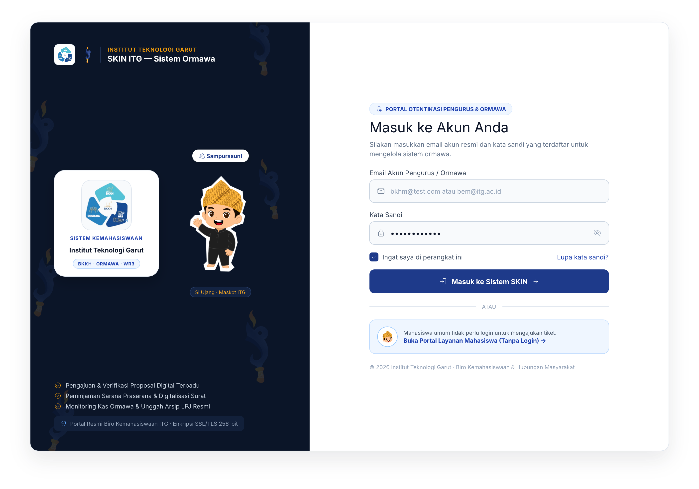
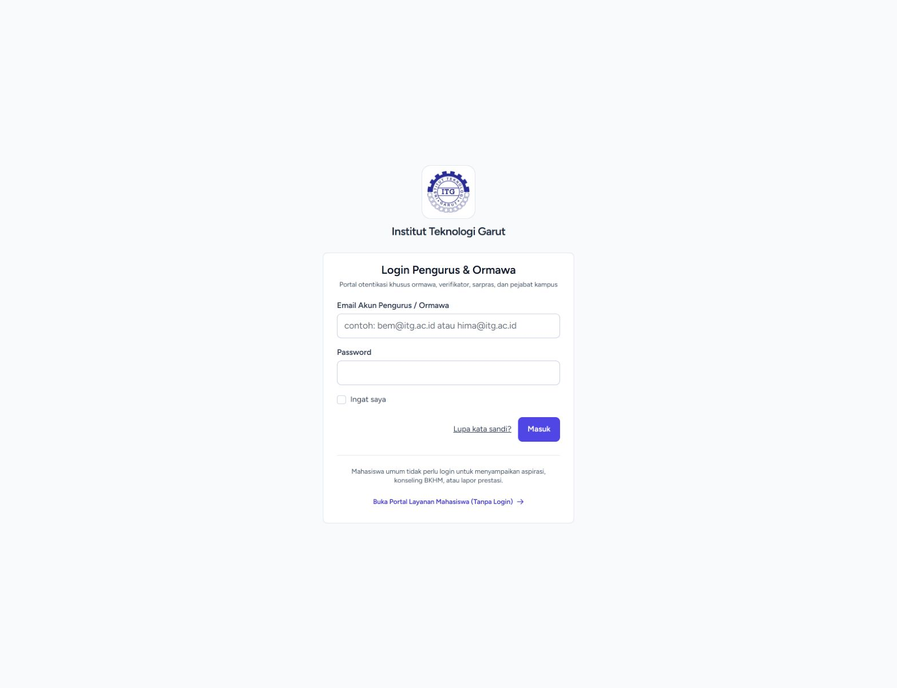
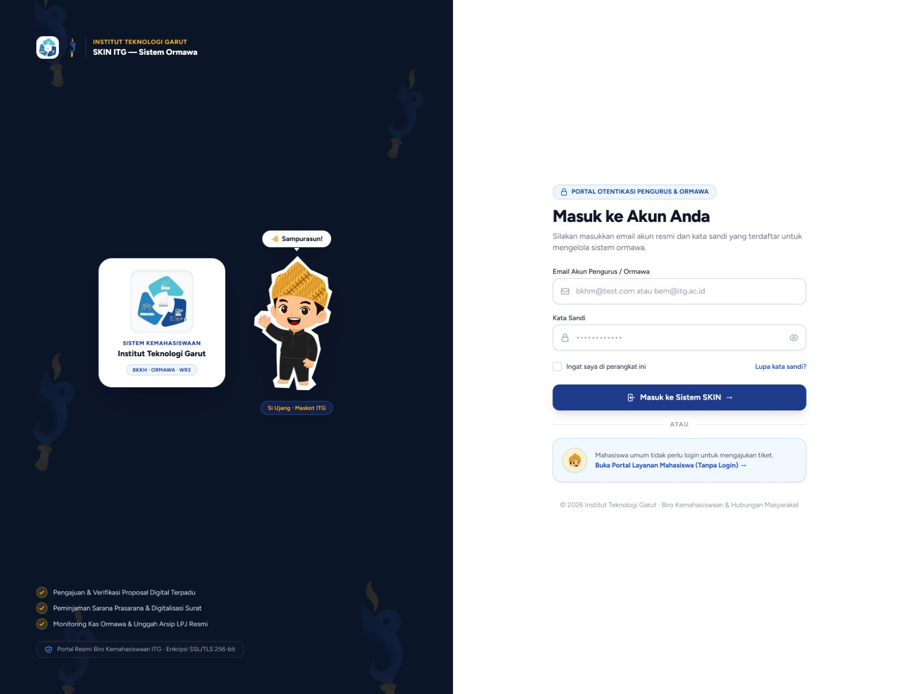

# 🔐 Dokumentasi Redesign UI — Halaman Login (Otentikasi Pengurus & Ormawa)

**Proyek:** SKIN ITG — Sistem Informasi Kemahasiswaan Terpadu  
**Halaman:** Otentikasi Akun Pengurus & Ormawa (`/login`)  
**Tanggal Update:** 30 September 2026  
**Tool Design:** pen.dev (Canvas: `SKIN UI Redesign.pen`)  
**Status Desain:** 🟢 **Prototype Split-Screen Selesai di Canvas pen.dev**

---

## 1. Latar Belakang & Analisis Permasalahan Baseline

Halaman login merupakan pintu gerbang utama bagi para pengurus organisasi mahasiswa (BEM, HIMA, UKM), verifikator kemahasiswaan, sarpras, dan pimpinan kampus. 

Pada tampilan **Baseline (Eksisting)**, ditemukan beberapa kelemahan UI/UX:
1. **Kurang Identitas Institusional:** Hanya berupa kotak form putih kecil mengambang di tengah layar kosong dengan logo ITG kecil. Nuansa kemahasiswaan dan wibawa akademik ITG kurang terpancar.
2. **Potensi Kebingungan Mahasiswa Umum:** Mahasiswa reguler yang ingin mengajukan tiket aspirasi, pelaporan, atau konseling sering tersasar ke halaman `/login` dan mengira harus mendaftar akun terlebih dahulu, padahal portal tiket bersifat terbuka tanpa login.
3. **Formulir yang Monoton:** Input field polos tanpa ikon pendukung, tombol submit kecil dengan warna ungu standar yang kurang mencerminkan warna resmi ITG (`#1E40AF`) maupun Kemahasiswaan (`#0B1528` & `#F59E0B`).

---

## 2. Konsep Solusi: Modern Split-Screen Institutional Layout

Desain baru mengadopsi pola **Split-Screen Layout (Layar Terbagi Dua)** yang memadukan wibawa identitas kampus di sisi kiri dan kepraktisan fungsional formulir otentikasi di sisi kanan.

### A. Sisi Kiri — Identitas Institusi, Showcase Card Logo SKIN & Sambutan Ramah "Si Ujang" (Brand Stage)
* **Latar Belakang Deep Academic Navy (`#0B1528`):** Dilengkapi dengan **Watermark Logo Obor Berwarna Asli** (*opacity 0.12 – 0.15*), menyelaraskan estetika institusi dengan *Hero Banner* Portal Layanan.
* **Identitas Ganda (*Dual Branding*):** Menampilkan lambang resmi alur SKIN (BKKH–ORMAWA–WR3) dalam wadah rounded putih dan Logo Obor Kemahasiswaan bersanding secara harmonis di header.
* **Kolaborasi Showcase Card Logo SKIN & Maskot Si Ujang:** 
  * Menampilkan **Showcase Card** putih melayang dengan logo resmi alur SKIN, teks sistem, institusi ITG, dan badge alur tripartit (`BKKH · ORMAWA · WR3`).
  * Bersanding di sampingnya adalah karakter **Si Ujang** menyapa hangat dengan balon sapaan lokal (*"👋 Sampurasun!"*) dan label tag resmi.
* **Ringkasan Fitur Ekosistem:** Memberikan penegasan 3 pilar layanan yang dikelola:
  * 📋 Pengajuan & Verifikasi Proposal Digital Terpadu
  * 🏛️ Peminjaman Sarana Prasarana & Digitalisasi Surat
  * 📊 Monitoring Kas Ormawa & Unggah Arsip LPJ Resmi
* **Badge Keamanan:** Label resmi *"Portal Resmi Biro Kemahasiswaan ITG · Enkripsi SSL/TLS 256-bit"*.

### B. Sisi Kanan — Formulir Otentikasi & UX Solution (Form Stage)
* **Header Jelas & Terstruktur:** Dilengkapi badge pill *"PORTAL OTENTIKASI PENGURUS & ORMAWA"* dan judul *"Masuk ke Akun Anda"*.
* **Field Modern & Aksesibel:**
  * Input Email dengan ikon amplop (*mail*).
  * Input Password dengan ikon gembok (*lock*) dan toggle mata (*visibility*) untuk mengecek kata sandi.
* **Kontrol Tambahan:** Checkbox *"Ingat saya di perangkat ini"* dan tautan bantuan *"Lupa kata sandi?"*.
* **Tombol Masuk Tegas:** Button navy solid dengan ikon panah masuk yang intuitif.
* **Kartu Solusi Mahasiswa Umum (Anti-Kebingungan):** Disediakan kartu panduan khusus dengan avatar Si Ujang di bawah garis pembatas:
  > *"Mahasiswa umum tidak perlu login untuk mengajukan tiket. Buka Portal Layanan Mahasiswa (Tanpa Login) →"*

---

## 3. Tabel Komparasi: Baseline vs Redesign Split-Screen

| Parameter | 🏛️ Baseline (Eksisting) | 🚀 Redesign Split-Screen (Baru) |
|---|---|---|
| **Struktur Tata Letak** | Single Card mengambang di tengah (*centered card*) | **Split-Screen 50:50 (Branding Stage + Auth Stage)** |
| **Latar Belakang** | Abu-abu/putih kosong monoton | **Deep Navy `#0B1528` + Watermark Obor Berwarna Asli** |
| **Maskot & Showcase Logo** | Tidak ada | **Showcase Card Logo SKIN ala AISnet + Maskot Si Ujang ("👋 Sampurasun!")** |
| **Identitas Branding** | Logo ITG kecil mandiri | **Dual Branding (Logo Resmi Alur SKIN + Logo Obor Kemahasiswaan)** |
| **Edukasi Fitur Sistem** | Tidak ada | **3 Poin Utama Layanan Ormawa di sisi kiri** |
| **Input Fields** | Plain input tanpa ikon | **Icon Prefix (Mail, Lock) + Password Visibility Toggle** |
| **Dukungan Mahasiswa Bebas Login** | Teks tautan kecil di bawah | **Highlight Card khusus berikon Si Ujang** |
| **Kesan Visual** | Monoton, kaku, dan dingin | **Institusional, megah, aman, dan bersahabat** |

---

## 4. Galeri Visual Desain Halaman Login

### 4.1 Tampilan Desain Redesign Split-Screen (Hasil Prototype)
> Desain modern split-screen yang menyatukan unsur akademis, keamanan sistem, dan keramahan maskot Si Ujang.

---

### 4.2 Tampilan Baseline Eksisting (Sebelum Redesign)
> Tampilan awal halaman login sistem sebelum dilakukan peremajaan antarmuka.

---

## 5. Koordinat & Posisi di Canvas pen.dev

Pada file `SKIN UI Redesign.pen`, frame halaman login ditempatkan pada **Baris ke-4**:
* **Baseline Eksisting:** Node `n5fOc` (`X: 0, Y: 4100`, Width: 1280px, Height: 860px)
* **Redesign Split-Screen:** Node `mqvT4` (`X: 1360, Y: 4100`, Width: 1280px, Height: 860px)

---

## 6. Status Implementasi ke Sistem (SELESAI & LIVE)

Implementasi desain split-screen modern telah berhasil diaplikasikan secara langsung ke dalam sistem SKIN ITG:
* ✅ [`resources/views/auth/login.blade.php`](../resources/views/auth/login.blade.php): Halaman login telah diperbarui penuh dengan struktur:
  * **Stage Branding Kiri:** Latar *Deep Academic Navy* (`#0B1528`), ornamen *watermark* Logo Obor monokrom transparan, *dual-branding* institusi (Logo Alur SKIN + Logo Obor), maskot **Si Ujang** dengan balon sapaan lokal (*"👋 Sampurasun! Wilujeng sumping para pengurus & ormawa"*), 3 poin layanan terpadu, dan lencana enkripsi SSL/TLS 256-bit.
  * **Stage Formulir Kanan:** Badge otentikasi resmi, input email ber-ikon surat, input kata sandi ber-ikon gembok dengan tombol interaktif intip kata sandi (*visibility toggle*), checkbox ingat saya, tombol masuk *midnight navy*, serta kartu khusus mahasiswa bebas login dengan avatar kepala Si Ujang.
* ✅ **Kompilasi Aset:** Asset CSS dan JS telah dikompilasi via `npm run build` (Vite) sehingga seluruh kelas utilitas Tailwind CSS aktif dan ter-render dengan sempurna.

### Tangkapan Layar Sistem Live (Setelah Implementasi)

