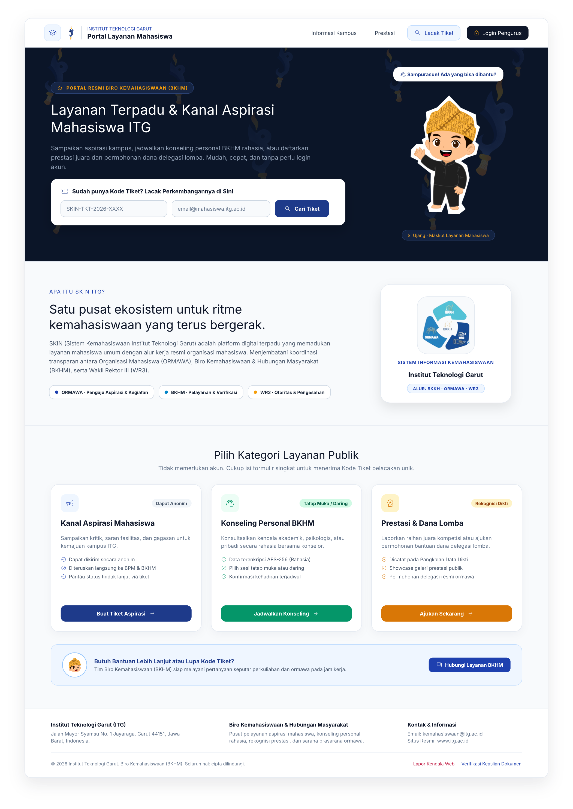
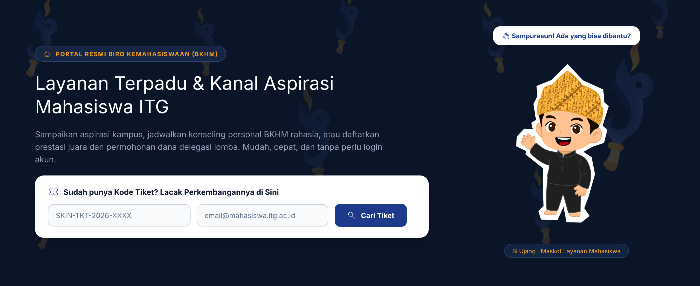
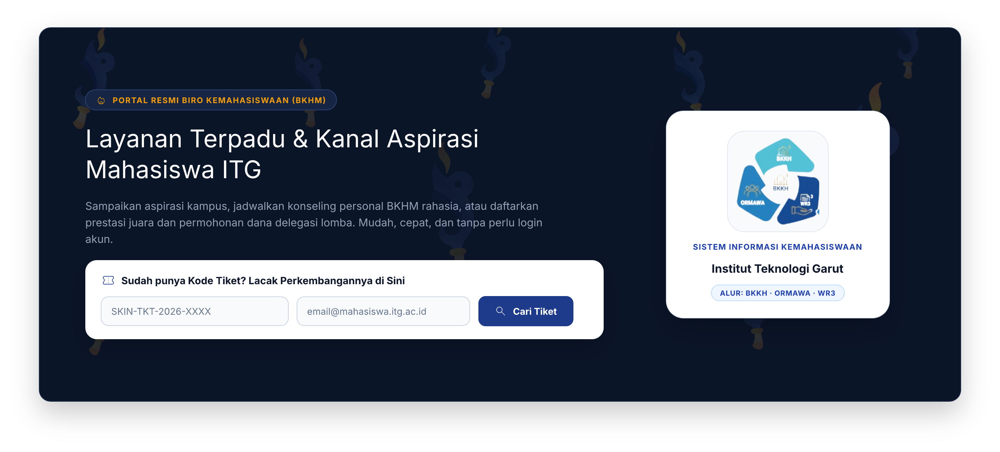
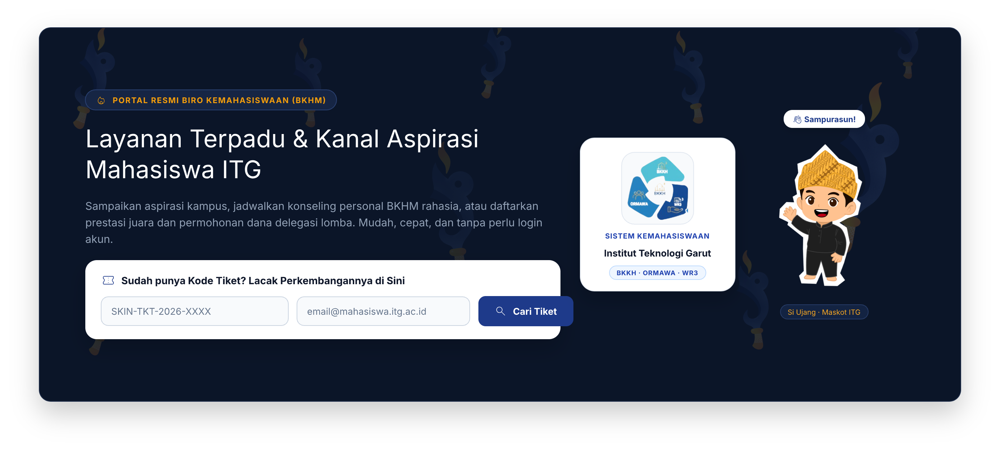
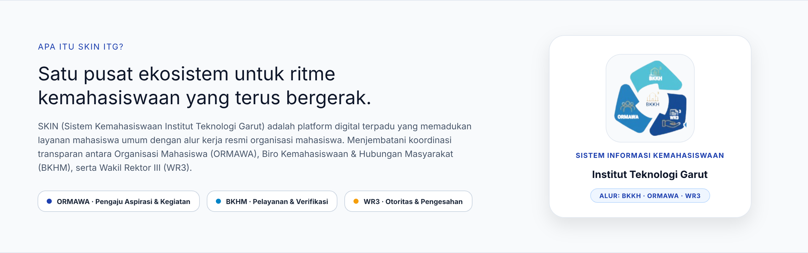
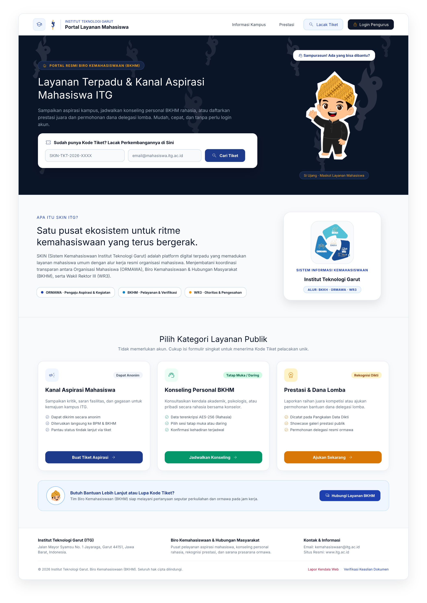
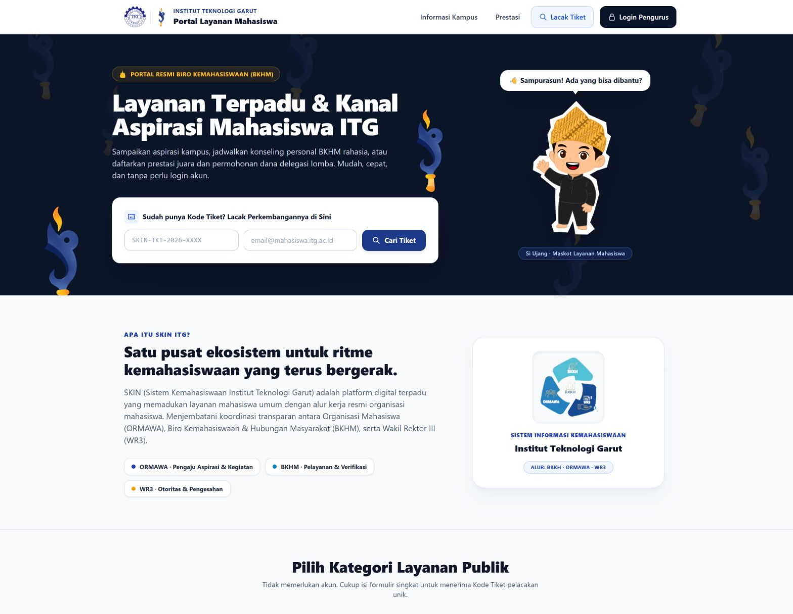
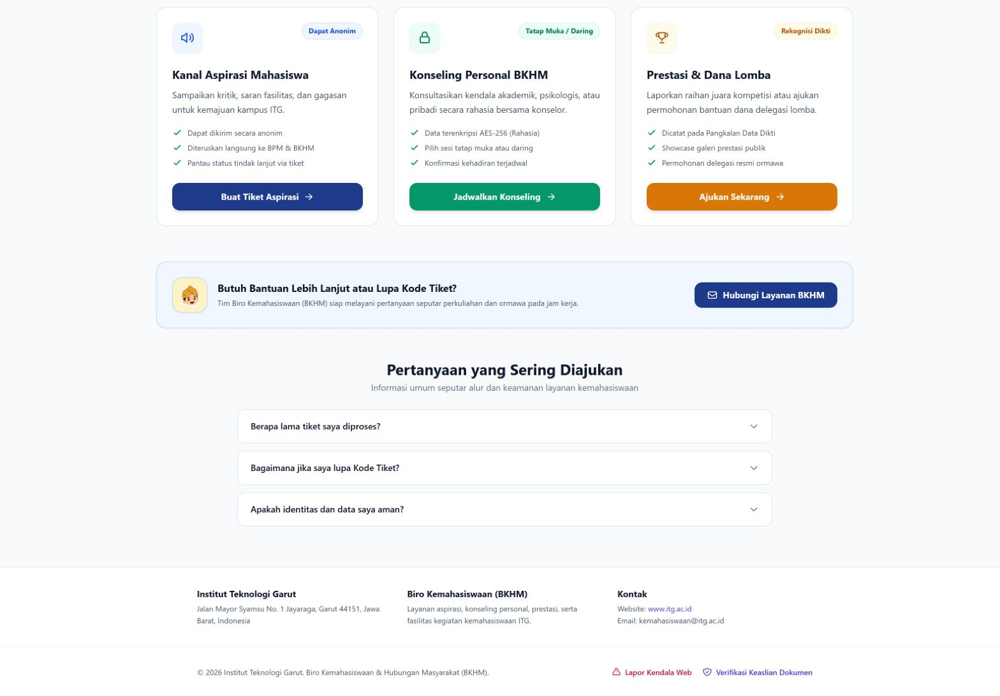

# 🎓 Dokumentasi Redesign UI — Portal Layanan Mahasiswa (Public)

**Proyek:** SKIN ITG — Sistem Informasi Kemahasiswaan Terpadu  
**Halaman:** Portal Publik Mahasiswa (`/` atau `public.tiket.index`)  
**Tanggal Update:** 30 September 2026  
**Tool Design:** pen.dev (Canvas: `SKIN UI Redesign.pen`)  
**Status Desain:** 🟢 **SELESAI & LIVE DI SISTEM (Hero Ornamen Logo Obor Berwarna + Section Showcase Logo SKIN ala AISnet)**

---

## 1. Latar Belakang & Keputusan Desain Terpilih

Berdasarkan masukan klien dan hasil evaluasi:
1. **Penambahan Maskot & Logo Obor Berwarna:** Karakter Maskot Mahasiswa Sunda ITG (Si Ujang) dan Logo Obor Kemahasiswaan Berwarna Asli (`logo-skin-torch.png`) resmi diterapkan sebagai latar belakang dinamis pada Hero Banner.
2. **Section Khusus Showcase Logo SKIN ala AISnet:** Logo resmi siklus alur SKIN (120×120px) ditempatkan pada section khusus perkenalan *"Apa Itu SKIN ITG?"* di antara Hero Banner dan Kategori Layanan Publik, memastikan seluruh teks alur (*BKKH, ORMAWA, WR3*) terbaca tajam dan tidak bertumpukan dengan maskot Si Ujang di banner atas.

---

## 2. Rincian Elemen Visual pada Desain Terpilih

| Elemen Visual | Posisi & Penempatan | Fungsi & Kesan Estetika |
|---|---|---|
| **Logo Obor Kemahasiswaan Berwarna** | Navbar (kiri) & Watermark Background Hero | Menjadi penanda resmi Biro Kemahasiswaan & Humas (BKHM). Di latar belakang hero, ornamen kobaran api keemasan dan kujang biru berulang dinamis dengan transparansi halus. |
| **Maskot Si Ujang Sunda ITG** | Sisi Kanan Hero Banner | Maskot berpose melambaikan tangan dengan balon sapaan *"👋 Sampurasun! Ada yang bisa dibantu?"*, menciptakan sambutan yang hangat dan bersahabat bagi mahasiswa. |
| **Section "Apa Itu SKIN ITG?"** | Di Antara Hero Banner & Kategori Layanan | Menyajikan narasi perkenalan sistem, 3 pilar alur (ORMAWA, BKHM, WR3), dan *Showcase Card* putih melayang dengan Logo Resmi SKIN berukuran besar (ala referensi kartu AISnet). |
| **Maskot Avatar (Kepala Saja)** | Kartu Bantuan (*Callout Banner*) | Memandu mahasiswa yang membutuhkan kontak langsung atau lupa kode tiket pelacakan. |

---

## 3. Galeri Desain Terpilih

### 3.1 Tampilan Halaman Penuh dengan Background Logo Obor Berwarna & Section SKIN ITG (Final & Live)
> Desain utuh Portal Layanan Mahasiswa dengan integrasi Logo Obor pada navbar, ornamen background warna asli pada Hero Banner, Maskot Si Ujang, formulir lacak tiket melayang, section pengenalan *"Apa Itu SKIN ITG?"* dengan Showcase Card Logo Resmi alur SKIN ala AISnet, 3 kategori layanan terstruktur, dan footer institusi.

### 3.2 Detail Hero Banner dengan Ornamen Logo Obor Berwarna (Warna Asli)
> Tampilan close-up resolusi tinggi dari Hero Banner dengan ornamen logo obor warna asli (kujang biru dan kobaran api emas).

### 3.4 Eksplorasi Hero Versi A: Card Showcase Logo SKIN ala AISnet (Mandiri)
> Meniru 100% pola kartu identitas aplikasi AISnet ITG (gambar referensi klien), di mana panggung kanan fokus menampilkan kartu rounded putih berkontras tinggi dengan logo alur SKIN berukuran besar (120×120px), teks sistem, dan nama institusi.

### 3.5 Eksplorasi Hero Versi A: Kombo Card Logo SKIN + Maskot Si Ujang
> Memadukan kartu identitas aplikasi ala AISnet ITG di sisi kiri panggung dengan kehadiran ramah Maskot Si Ujang di sisi kanan lengkap dengan balon sapaan lokal Sunda.

### 3.6 Solusi Penempatan Terbaik: Section "Apa Itu SKIN ITG?" (Di Antara Banner & Kategori Layanan) ⭐
> Menempatkan kartu showcase logo resmi alur SKIN bersama narasi perkenalan platform tepat di antara Hero Banner dan Kategori Layanan Publik. Pendekatan ini mempertahankan keramahan maskot Si Ujang di hero atas, sekaligus memberikan panggung khusus yang megah dan edukatif bagi Logo Resmi SKIN ITG sesuai referensi AISnet.

#### Tampilan Keseluruhan Halaman Portal dengan Section Tersebut:

---

## 4. Struktur Objek di Canvas pen.dev

Pada file `SKIN UI Redesign.pen`, seluruh elemen tertata secara sistematis:

* **Baris 1 (`Y: 0 – 1100`): Redesign Sidebar Navigation**
  * Baseline Eksisting (X: 0)
  * Opsi 1 Deep Academic Navy (X: 310)
  * Opsi 2 Clean Campus Light (X: 630)
  * Dashboard Penuh Eksisting (X: 980)
* **Baris 2 (`Y: 1300 – 2900`): Redesign Portal Layanan Mahasiswa**
  * `[Bg3ov]` Baseline Portal Eksisting (X: 0)
  * `[ubWni]` **Desain Halaman Penuh Portal Layanan dengan Background Monokrom Terpilih** (X: 1360)
* **Baris 3 (`Y: 3000 – 3800`): Komparasi Banner Hero**
  * `[Wu4DL]` Hero Versi A — Ornamen Warna Asli (X: 0)
  * `[lfAJj]` **Hero Versi B — Ornamen Monokrom [APPROVED]** (X: 1360)

---

## 5. Status Implementasi ke Sistem (SELESAI & LIVE)

Implementasi desain terpilih telah berhasil diaplikasikan secara langsung ke dalam sistem SKIN ITG:
* ✅ [`resources/views/components/public-layout.blade.php`](../resources/views/components/public-layout.blade.php): Navbar publik telah diperbarui dengan *dual-branding* (Logo ITG + Logo Obor Kemahasiswaan), tipografi institusional, dan tombol cepat *Login Pengurus*.
* ✅ [`resources/views/public/tiket/index.blade.php`](../resources/views/public/tiket/index.blade.php): Halaman depan publik telah diperbarui mencakup:
  * Hero Section *Deep Academic Navy* (`#0B1528`) dengan repetisi ornamen *watermark* Logo Obor monokrom transparan.
  * Panggung Maskot **Si Ujang** dengan balon sapaan Sunda (*"👋 Sampurasun! Ada yang bisa dibantu?"*).
  * Formulir melayang pelacakan tiket mandiri.
  * 3 Kartu Kategori Layanan (Aspirasi, Konseling, Prestasi) dengan fitur *checklist*, badge pill, dan tombol aksi terpadu.
  * *Callout banner* bantuan cepat dengan avatar kepala Si Ujang.
* ✅ **Kompilasi Aset:** Asset CSS & JS telah berhasil dikompilasi melalui `npm run build` (Vite) untuk memastikan seluruh kelas Tailwind CSS aktif dan ter-render dengan sempurna.

### Tangkapan Layar Sistem Live (Setelah Implementasi)

