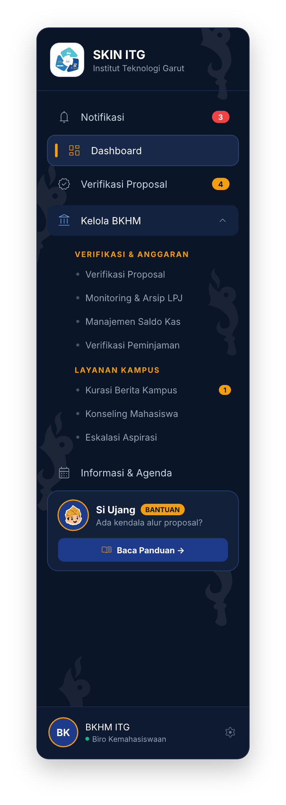
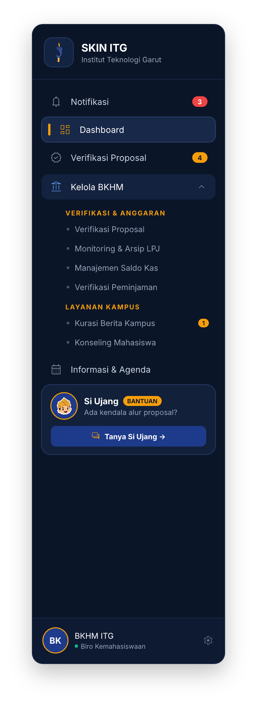
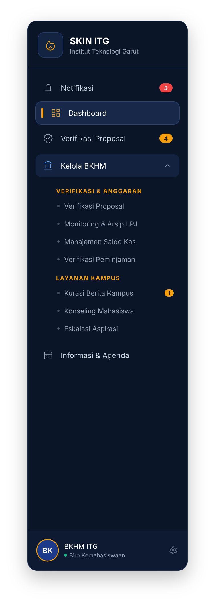
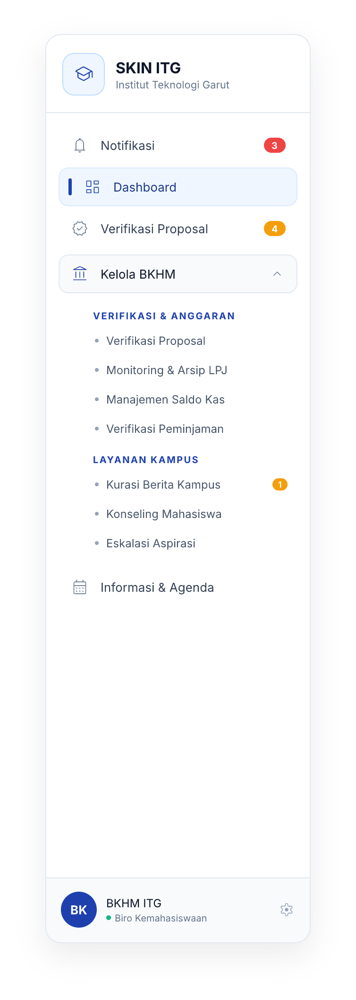
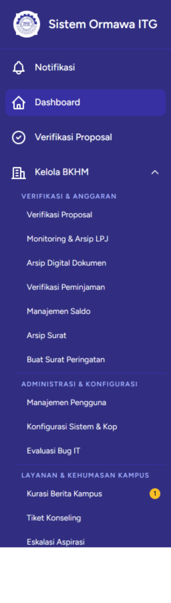
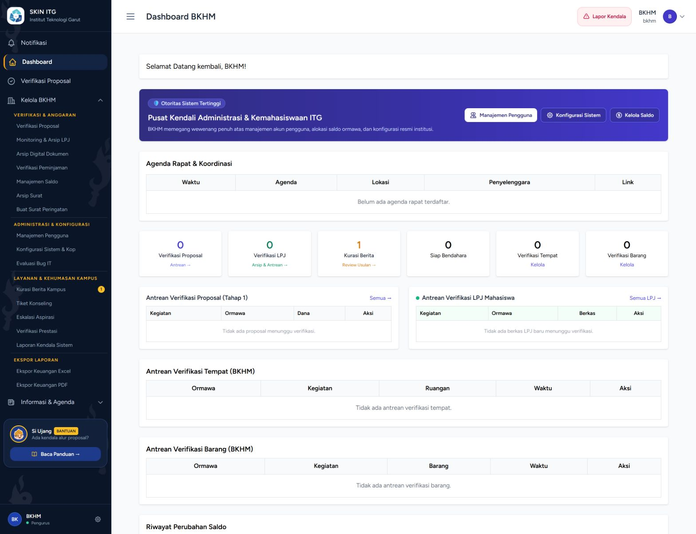
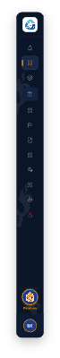
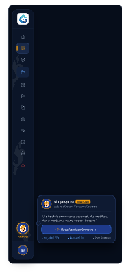

# 📐 Dokumentasi Redesign UI — Sidebar Navigation

**Proyek:** SKIN ITG — Sistem Informasi Kemahasiswaan Terpadu  
**Tanggal Update:** 30 September 2026  
**Tool Design:** pen.dev (Canvas: `SKIN UI Redesign.pen`)  
**Status:** 🟢 **SELESAI & LIVE DI SISTEM (Opsi 4 Watermark Monokrom + Kartu Si Ujang "Baca Panduan")**

---

## 1. Analisis Referensi Warna & Unsur Identitas

Desain sidebar mengadopsi 3 aset resmi institusi:
1. **Logo Resmi ITG:** Roda gigi & rantai biru (`#1E40AF`) dengan ruang putih bersih (`#FFFFFF`).
2. **Logo Obor Kemahasiswaan (SKIN ITG):** Badan kujang biru navy (`#0B1528` – `#1E3A8A`) dengan kobaran api keemasan (`#F59E0B`).
3. **Maskot Si Ujang:** Karakter mahasiswa ramah berbusana adat Sunda (pangsi hitam dan iket/totopong batik Garutan emas).

---

## 2. Tabel Komparasi: Baseline vs 4 Opsi Desain Sidebar

| Parameter | 🏛️ Baseline (Eksisting) | 🌌 Opsi 1: Deep Navy | ☀️ Opsi 2: Clean Light | 🦊 Opsi 3: Edisi Si Ujang | 🛡️ Opsi 4: Watermark Monokrom |
|---|---|---|---|---|---|
| **Latar Belakang** | Ungu `indigo-900` flat | Midnight Navy `#0B1528` polos | Pure White `#FFFFFF` | Midnight Navy `#0B1528` | **Midnight Navy + Watermark Logo Obor Monokrom** |
| **Watermark Ornamen** | Tidak ada | Tidak ada | Tidak ada | Tidak ada | **Repetisi Siluet Logo Obor Monokrom (`opacity 0.06–0.08`)** |
| **Logo Header** | Lingkaran putih generik | Ikon api obor rounded | Lambang akademik ITG | Logo Asli Obor Kemahasiswaan | **Logo Resmi Alur SKIN (BKKH-ORMAWA-WR3)** |
| **Aksen Aktif** | Box ungu flat | Bar Emas `#F59E0B` + Pill Navy | Bar Biru `#1E40AF` + Pill Soft Blue | Bar Emas `#F59E0B` + Pill Navy | **Bar Emas `#F59E0B` + Pill Navy Terangkat** |
| **Widget Maskot** | Tidak ada | Tidak ada | Tidak ada | Kartu Pendamping Si Ujang ("Tanya Si Ujang") | **Kartu Pendamping Si Ujang ("Baca Panduan")** |
| **Karakter Visual** | Kaku, monoton | Institusional berwibawa | Bersih & ramah mata | Interaktif & ramah mahasiswa | **Elegan, prestisius, selaras Hero Portal + Fitur Panduan** |

---

## 3. Galeri Visual 4 Opsi Desain Baru

### 3.1 Opsi 4: Deep Academic Navy dengan Watermark Monokrom & Kartu "Baca Panduan" Si Ujang *(Pilihan Terlengkap)*
> Mengadopsi struktur Opsi 1 (Deep Navy), diperkaya dengan **tekstur ornamen siluet Logo Obor Monokrom putih transparan (*opacity 0.06 – 0.08*)** pada latar belakangnya, serta dilengkapi **Kartu Pendamping Si Ujang (*Companion Card*)** dengan tombol aksi khusus **"Baca Panduan →"** sebagai akses instan panduan regulasi, SOP proposal, dan LPJ bagi ormawa.



---

### 3.2 Opsi 3: Edisi Khusus Maskot Si Ujang & Logo Obor Kemahasiswaan
> Mengintegrasikan Logo Obor Kemahasiswaan asli pada header brand, serta menghadirkan **Kartu Pendamping Si Ujang (*Companion Card*)** sebelum footer sebagai akses cepat panduan alur proposal/LPJ bagi ormawa.



---

### 3.3 Opsi 1: Deep Academic Navy & Flame Gold Accent (Polos)
> Biru navy tua institusi dengan aksen lidah api emas menyala pada menu aktif. Berkesan megah, berwibawa, dan resmi dengan latar bersih tanpa watermark.



---

### 3.4 Opsi 2: Modern Campus Clean Light
> Mengadopsi dominasi putih bersih dengan aksen Royal Blue ITG. Sangat direkomendasikan untuk staf yang bekerja lama menatap layar di ruangan terang (*low eye fatigue*).



---

### 3.5 Baseline: Tampilan Sidebar Saat Ini (Pembanding Histori)
> Tampilan awal sistem sebelum proses perancangan ulang.



---

## 4. Tata Letak Objek di Canvas pen.dev

Pada file `SKIN UI Redesign.pen`, seluruh opsi sidebar tertata sejajar secara horizontal di baris pertama (`Y: 70`):

* **X: 0** ➔ `[M7ctJ]` Sidebar Saat Ini (Baseline BKHM)
* **X: 310** ➔ `[SZojl]` **Sidebar Opsi 1 (Deep Academic Navy Polos)**
* **X: 630** ➔ `[p44rT]` **Sidebar Opsi 2 (Clean Campus Light)**
* **X: 950** ➔ `[NfS2h]` **Sidebar Opsi 3 (Edisi Maskot Si Ujang & Logo Obor)**
* **X: 1280** ➔ `[MqnIx]` **Sidebar Opsi 4 (Watermark Logo Obor Monokrom) ⭐**
* **X: 1620** ➔ `[T2MDdb]` Tangkapan Layar Penuh Dashboard BKHM

---

## 5. Rekomendasi Implementasi Tailwind CSS (Opsi 4)

Implementasi watermark monokrom pada sidebar Blade [`resources/views/layouts/sidebar.blade.php`](../resources/views/layouts/sidebar.blade.php):
```html
<aside class="relative flex flex-col w-64 h-screen bg-[#0B1528] text-white border-r border-[#1E2D4A] overflow-hidden select-none">
    <!-- Watermark Layer (Pointer-events-none) -->
    <div class="absolute inset-0 pointer-events-none overflow-hidden select-none z-0">
        
        
        
        
        
    </div>

    <!-- Foreground Content (Header, Navigation, Footer) -->
    <div class="relative z-10 flex flex-col h-full">
        <!-- Header Brand -->
        ...
        <!-- Navigation Body -->
        ...
        <!-- User Profile Footer -->
        ...
    </div>
</aside>
```

---

## 6. Hasil Implementasi Live pada Sistem

Sidebar Opsi 4 telah berhasil diintegrasikan ke dalam layout utama dashboard dan dikompilasi menggunakan Vite (`resources/views/layouts/sidebar.blade.php`).



### Ringkasan Fitur yang Berjalan:
1. **Logo Resmi SKIN ITG:** Menampilkan lambang alur trinitas kemahasiswaan SKIN (BKKH – ORMAWA – WR3) dengan wadah rounded putih berkontras tinggi di header sidebar.
2. **Latar Belakang & Watermark:** Warna Deep Academic Navy (`#0B1528`) dengan repetisi ornamen monokrom Logo Obor SKIN putih transparan.
3. **Indikator Aktif Berkelas:** Bilah aksen vertikal kuning keemasan (`#F59E0B`) dengan sorotan latar belakang item terpilih (`#132342`).
4. **Kartu Pendamping Si Ujang:** Maskot Si Ujang ramah dengan label status `BANTUAN`, subjudul ringkas, dan tombol aksi terarah **"Baca Panduan →"** menuju panduan alur proposal/LPJ.
5. **Interaksi Alpine.js:** Accordion submenu (Kelola BKHM, Informasi & Agenda) dan state expand/collapse sidebar tetap berfungsi optimal.

---

## 7. Desain & Implementasi Mode Ringkas (Collapsed Slide 80px) — Variasi B

Pada saat sidebar dalam kondisi tertutup / menciut (`!sidebarOpen`, lebar `w-20` / 80px), diterapkan **Variasi B (Docked Bottom)**:




### Keunggulan & Spesifikasi Teknis:
1. **Tombol Circular Si Ujang (Docked Permanen):**
   - Tersemat tepat di atas profil pengguna dan dipisahkan garis pembatas halus (`border-[#1E2D4A]/70`).
   - Berdiameter 44×44px dengan latar Navy Blue (`#1E3A8A`), border emas kontras 2px (`#F59E0B`), bayangan *amber glow*, dan *ping dot indicator*.
   - Micro-label **"PANDUAN"** berukuran 9px emas tebal di bawah lingkaran.
2. **Flying Popover Card (Interaksi Hover / Click):**
   - Saat ikon disorot kursor, muncul kartu melayang (*flyout*) selebar 288px ke sisi kanan dengan panah penunjuk (*pointer arrow*).
   - Menampilkan identitas *"Si Ujang ITG - Bantuan"*, deskripsi panduan, tombol CTA **"Baca Panduan Ormawa →"**, serta tautan cepat SOP & Regulasi.
3. **Arsitektur Layout Bebas Clipping:**
   - Tag `<nav>` menggunakan `h-full border-r z-30` tanpa `overflow-y-auto` di level root, sehingga kartu popover melayang bebas di atas area konten tanpa terpotong.
   - Area menu navigasi tengah menggunakan `flex-1 overflow-y-auto skin-scrollbar` yang dapat di-scroll secara independen.

