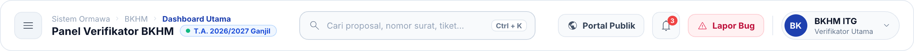
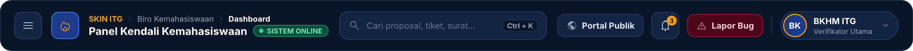
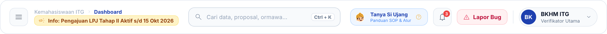
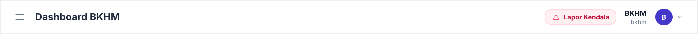

# 🧭 Dokumentasi Redesign UI — Top Bar (Header Dashboard)

**Proyek:** SKIN ITG — Sistem Informasi Kemahasiswaan Terpadu  
**Komponen:** Header Navigasi Atas Dashboard (`layouts.app` & `layouts.user-menu`)  
**Tanggal Update:** 30 September 2026  
**Tool Design:** pen.dev (Canvas: `SKIN UI Redesign.pen`)  
**Status Desain:** 🟢 **Opsi 1 (Clean Academic Light) Selesai & Live Terimplementasi di Sistem**

---

## 1. Latar Belakang & Analisis Permasalahan Baseline

Top Bar (Header) adalah komponen krusial yang selalu berada di bagian atas layar (*sticky header*) saat staf BKHM, verifikator, maupun pengurus ormawa mengoperasikan sistem.

Pada tampilan **Baseline (Eksisting)**, ditemukan beberapa batasan fungsionalitas dan estetika:
1. **Ruang Tengah Kosong Tak Termaksimalkan:** Area tengah layar kosong tanpa utilitas produktivitas, padahal staf sangat membutuhkan pencarian cepat (*Quick Search*) untuk melacak proposal, nomor surat tugas, atau tiket mahasiswa.
2. **Tidak Ada Jejak Navigasi (Breadcrumb):** Pengguna hanya melihat teks judul halaman statis tanpa mengetahui posisi hierarki modul yang sedang dibuka.
3. **Tombol "Lapor Kendala" Terlalu Dominan & Kontras:** Tombol lapor kendala berwarna merah muda mencolok (*alert-like*) sehingga mengalihkan fokus dari aksi utama dashboard.
4. **Minim Identitas Periode & Notifikasi:** Tidak terdapat indikator semester/tahun akademik yang sedang aktif (*T.A. Aktif*) maupun pusat notifikasi permohonan baru.

---

## 2. Tabel Komparasi: Baseline vs 3 Opsi Desain Top Bar

| Parameter | 🏛️ Baseline (Eksisting) | ☀️ Opsi 1: Clean Academic Light | 🌌 Opsi 2: Deep Academic Navy | 🦊 Opsi 3: Edisi Interaktif Si Ujang |
|---|---|---|---|---|
| **Warna Latar** | Putih flat border tipis | Pure White `#FFFFFF` + Soft Border `#E2E8F0` | Midnight Navy `#0B1528` (High Contrast) | Pure White `#FFFFFF` + Accent Tag |
| **Navigasi & Konteks** | Teks judul statis biasa | **Breadcrumb 3 Level + Indikator Semester Aktif** | **Breadcrumb Ringkas + Logo Obor Emas + Status Online** | **Breadcrumb + Mini Banner Kalender Akademik Aktif** |
| **Pusat Pencarian (Search)** | Tidak ada | **Global Search Bar + Shortcut `Ctrl + K`** | **Dark Search Bar + Shortcut `Ctrl + K`** | **Quick Search Bar + Shortcut `Ctrl + K`** |
| **Akses Web Publik** | Tidak ada | Tombol Quick Link *"Portal Publik"* | Tombol Quick Link *"Portal Publik"* | Terintegrasi |
| **Pusat Notifikasi** | Tidak ada | Lonceng Notifikasi + Badge Count Merah `3` | Lonceng Notifikasi + Badge Count Emas `3` | Lonceng Notifikasi + Badge Count Merah `3` |
| **Widget Edukatif / Bantuan** | Tidak ada | Tidak ada | Tidak ada | **Widget Khusus *"Tanya Si Ujang"* (Panduan SOP)** |
| **User Profile Menu** | Inisial bulat ungu standar | Chip Profil Lengkap + Role *"Verifikator"* | Chip Dark Navy + Ring Emas + Role | Chip Profil Lengkap + Role *"Verifikator"* |

---

## 3. Galeri Visual Desain Top Bar

### 3.1 Opsi 1: Clean Academic Light (Pusat Pencarian Global & Breadcrumb Dinamis)
> Mengusung estetika cerah, bersih, dan rapi yang nyaman untuk penggunaan durasi lama. Dilengkapi *breadcrumb* navigasi berlapis, indikator semester aktif (*T.A. 2026/2027 Ganjil*), kotak pencarian terpadu dengan pintasan keyboard `Ctrl + K`, tombol portal publik, lonceng notifikasi, serta kartu profil berwibawa.

---

### 3.2 Opsi 2: Deep Academic Navy (High-Contrast, Prestisius & Selaras Sidebar Opsi 1/4)
> Dirancang dengan latar *Deep Academic Navy* (`#0B1528`) yang sangat padu jika disandingkan dengan **Sidebar Opsi 1 atau Opsi 4**. Menonjolkan sentuhan api obor keemasan (`#F59E0B`), badge status sistem online warna zamrud, dan pencarian bertema gelap berfokus tinggi.

---

### 3.3 Opsi 3: Edisi Interaktif Maskot Si Ujang & Pengumuman Kalender Akademik
> Mengintegrasikan keramahan maskot kampus melalui **Widget Interaktif "Tanya Si Ujang"** di sisi kanan untuk akses panduan cepat regulasi/SOP bagi ormawa. Di sisi kiri, terdapat *Announcement Pill* dinamis yang menampilkan tenggat waktu administrasi penting (misal: periode pengajuan LPJ).

---

### 3.4 Baseline Eksisting (Tampilan Saat Ini)
> Tampilan awal sistem sebelum perombakan antarmuka untuk tolok ukur evaluasi.

---

## 4. Struktur Objek di Canvas pen.dev

Pada file `SKIN UI Redesign.pen`, seluruh variasi Top Bar ditempatkan pada **Baris ke-5 (`Y: 5200 – 5900`)**:
* **Label Section:** Node `n8Q3jj` & `ZJSvE` (`Y: 5200`)
* **Baseline Eksisting:** Node `IW4Ih` (`X: 0, Y: 5316`, Width: 1280px, Height: 64px)
* **Opsi 1 Clean Light:** Node `A0vruI` (`X: 0, Y: 5456`, Width: 1280px, Height: 72px)
* **Opsi 2 Deep Navy:** Node `B6fTo` (`X: 0, Y: 5616`, Width: 1280px, Height: 72px)
* **Opsi 3 Edisi Si Ujang:** Node `T5hqlB` (`X: 0, Y: 5776`, Width: 1280px, Height: 72px)

---

## 5. Rencana Penerapan ke Blade & Alpine.js

Ketika salah satu opsi disetujui, perubahan akan diimplementasikan pada file `resources/views/layouts/app.blade.php` dan `resources/views/layouts/user-menu.blade.php`:

1. **Pintasan Keyboard Pencarian (`Ctrl + K`):** Menggunakan event listener Alpine.js `@keydown.window.prevent.ctrl.k="searchOpen = true"` untuk memicu modal *command palette*.
2. **Breadcrumb Dinamis:** Menghubungkan variabel `$breadcrumbs` yang dioper dari Controller atau Blade directive.
3. **Indikator Periode Akademik:** Mengambil data semester aktif dari database konfigurasi kampus (`App\Models\PeriodeAkademik::active()`).
4. **Widget "Tanya Si Ujang" (Bila Opsi 3 dipilih):** Membuka laci samping (*offcanvas drawer*) berisi FAQ interaktif dan alur panduan proposal/LPJ.
